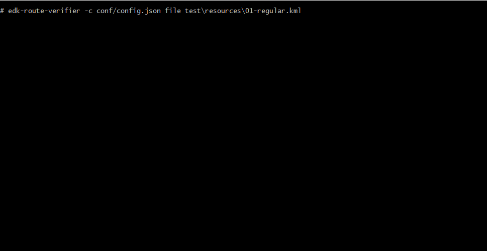

# EDK Route Verifier

[](https://circleci.com/gh/cloudify-cosmo/cloudify-ui-components)
[](https://github.com/facebook/jest)
[](https://cypress.io)
[](https://www.npmjs.com/package/edk-route-verifier)

**EDK Route Verifier** is a tool which allows user to verify provided KML file with [EDK](https://edk.org.pl) route against predefined set of rules (eg. minimal length) and provide route characteristics (eg. length, elevations).

It is delivered in 3 different flavours: API server, CLI tool and UI version.

[](docs/UI.md)

[](docs/CLI.md)

### Usage

#### Prerequisities
* [NodeJS](https://nodejs.org) >= v12.x (using ES modules)
* [Google Maps API Key](https://developers.google.com/maps/documentation/javascript/get-api-key) (using the following APIs: Google Maps Elevation API, Google Maps Embed API, Google Maps JavaScript API)

#### Installation
 
```shell script
npm install --global edk-route-verifier
```

#### Configuration

You need to create JSON configuration file containing at least Google Maps API key. 

You can use [config.json.template](conf/config.json.template) file as a base.


#### Start

Check out usage at in [CLI usage documentation](docs/USAGE.md) or just execute:
  
```shell script
edk-route-verifier --help
```

To start verifier you will need configuration file created in previous step. To run verifier as API server execute:

```shell script
edk-route-verifier server -c config.json
```

### Flavours

**EDK Route Verifier** is delivered in 3 different flavours: 

1. [API](docs/API.md) - starts HTTP server exposing verification endpoint 
2. [CLI](docs/CLI.md) - allows user to verify EDK route from command line
3. [UI](docs/UI.md) - allows user to verify EDK routes with web UI


### Testing

#### Local

Tests are developed using [Jest](https://jestjs.io/) and [Cypress](https://www.cypress.io/) frameworks. All test-related code is stored in `test` subdirectory.

To run all tests (UI, API, CLI + static code analysis):

```shell script
npm run test
```

#### Continuous Integration

[CircleCI](https://circleci.com/gh/edk-software/edk-route-verifier) web application is used as for CI management. See [.circleci/config.yml](.circleci/config.yml) file for details of the build and test job configuration.

You can create your own branch, push it to remote and CI will start automatically. That way you can test your code even if you don't have local environment configured (NodeJS, Google Maps API Key, etc.).

### Deployment

`edk-route-verifier` is published in NPM registry. 

Follow this step-by-step guide to publish new version:
1. Create configuration file `conf/config.json`
2. Checkout `master` branch
3. Execute `npm run publish:[prerelease|patch|minor|major]`
4. After successful execution, check [CircleCI](https://circleci.com/gh/edk-software/edk-route-verifier)
5. If everything went fine, then create release in [GitHub releases](https://github.com/edk-software/edk-route-verifier/tags)
