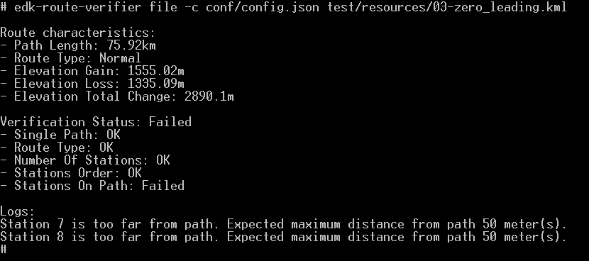

## CLI

**EDK Route Verifier** in CLI flavour provides user command-line tool to run route verification on provided KML file.



### Configuration

No specific configuration.

### Start

Assuming your configuration file is `config.json` and your KML file is `route.kml` you can start  
```shell script
edk-route-verifer file -c config.json route.kml
```

Verification output is presented in user friendly format on standard output.
