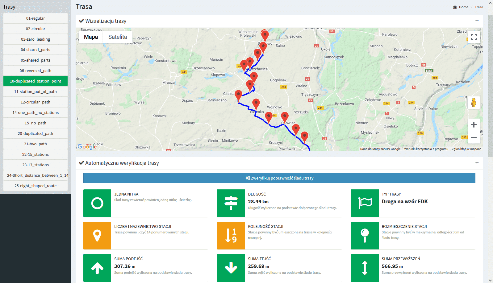

## UI

**EDK Route Verifier** in UI flavour provides web page listing all KML files in configured folder and verification pane.



### Configuration

You need to specify KML files folder in configuration file by providing `resourcesPath` parameter.

See: [configuration file template](../conf/config.json.template).

### Start

Assuming your configuration file is `config.json` you can start  
```shell script
edk-route-verifer ui -c config.json
```

Web server is started on `localhost`. Port is presented to the user.
